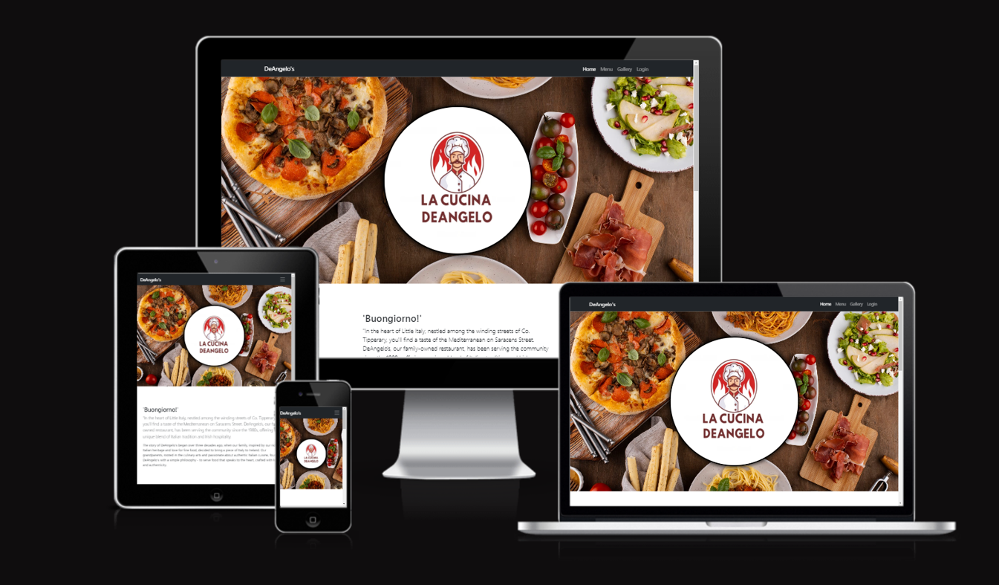

# DeAngelo's Restaurant Booking System

DeAngelo's Restaurant Booking System is a comprehensive digital solution developed to streamline and enhance the dining experience for both customers and administrators of DeAngelo's, a popular local fictitious eatery. The application integrates a range of user-friendly functionalities, offering a seamless interface between customers and staff.

The platform has been primarily developed to cater to the needs of restaurant-goers and the restaurant's administrative personnel. It provides an efficient online booking system for customers seeking to reserve tables at their convenience, while also allowing them to view the restaurant's extensive menu. This interactive, easy-to-navigate system greatly simplifies the booking process and ensures customers can plan their visit to DeAngelo's without any hassle.

For the administrative personnel of DeAngelo's, this system provides a robust back-end solution that offers an overview of the bookings, enables menu management, and handles table arrangements. This ensures smooth operations and improved organization within the restaurant, leading to better service quality and enhanced customer satisfaction.

The DeAngelo's Restaurant Booking System aims to bridge the gap between conventional restaurant management and the growing need for digital interaction in the hospitality industry. With its simple, intuitive design, and effective functionality, it offers a unique, improved dining experience for customers while ensuring efficient, organized operations for the restaurant's staff and administration.

## Existing features 

- Navigation Bar for customers 
   - When visitors first land on the home page they will see a top nav bar with links to four pages, Home, Menu, Gallery and login. The DeAngelo's branding is also displayed on the left hand side. Clicking the logo returns the user back to the home page.
   - On larger screens a more traditional navigation is displayed, on smaller screens the navigation reverts to a hamburger menu.

  - Registered users will have extra links to their profile page and to the reservations page. The login link changes to logout.

  
  - Signed in Admins will have an extra link to the Admin App

### Site Home Page

The site home page contains a hero image of the Italian countryside. It gives the visitor a sense of the rich, serene, and rustic ambiance associated with traditional Italian dining, setting the stage for a culinary journey through the delights of Italian cuisine.

There is also a section containing a brief synopsis of the restaurant's history.

Scrolling to the lower segment of the home page, the viewer is greeted with a warmly inviting image of the restaurant's interior. The restaurant address and phone number are also displayed.

### Site Footer

the site footer is displayed on all front facing pages. It contains the copyright symbol. Here, visitors can explore a wider array of content concerning the restaurant, with every link thoughtfully designed to open in a separate tab, ensuring undisturbed navigation."

### Menu Page

The menu page contains vibrant imagery of our delectable dishes. Accompanied by both detailed descriptions and transparent pricing, it offers an enticing preview of the culinary delights that await our guests.

### Gallery Page

The gallery page showcases an array of captivating images which we feel captures the essence of our restaurant. To elevate user experience, a simple click on an image triggers a seamless on-page enlargement, offering an up-close view of the image. Additionally, users can effortlessly navigate through these magnified images - right and left - without the need to close each picture first, thereby ensuring a smooth, uninterrupted exploration."

### Reservation Page

The reservation page, accessible only to registered users, elegantly presents a booking form with an accompanying guide on how to fill it out. As the user inputs their details, a script diligently checks the availability of the requested tables. The form incorporates an intelligent validation system, eliminating the possibility of selecting past dates and ensuring that the number of guests does not surpass the capacity of the chosen tables. Furthermore, each table becomes available for new reservations two hours after the start of the previous booking. Only when all these checks are satisfied does the form's submission button become enabled, ensuring a smooth and error-free reservation experience.

This message is displayed when the table is available and all necessary information is provided.

This message is displayed when the table is not available.

These errors are displayed if a date in the past is selected or when a time slot selected is too close to closing time.

Upon making a successful reservation, an automated confirmation email is dispatched to the email address specified in the booking form. Simultaneously, a duplicate of this email is forwarded to the administration group to ensure seamless communication and efficient management.

### Profile Page

The profile page neatly catalogues all the bookings made by a user, affording them the convenience of managing their reservations. Users have the capability to edit or delete their upcoming bookings, ensuring flexibility. However, any bookings from the past remain uneditable and undeletable.

### Login Link

Regular users, upon successful login, are directed to their profile page where they can manage their reservations. Administrators, on the other hand, are guided straight to the admin application, allowing for seamless management of the platform. Non registerd users can click the register link which opens the registration form. 

### Registration

The registration form facilitates the creation of user accounts. To ensure a smooth and transparent registration process, the form clearly outlines the guidelines and requirements for successful account creation.

### Admin App

The Admin App serves as the central hub for site administrators to manage and optimize the DeAngelo's site. The home page of the admin panel displays basic site information.

### Admin Navigation

On devices with larger screen resolutions, the site navigation retains a traditional look and feel. However, for mobile screens, the navigation transitions to a responsive hamburger menu, optimizing user interaction on smaller devices.

The admin navigation contains site management links for, DeAngelo's website, menu items, tables, bookings and the logout feature.

### Admin Menu Items

The 'Menu Items' page displays all current dishes at DeAngelo's. Admins can easily edit or delete items via dedicated buttons. There's also a convenient button for adding new items.

Selecting the 'Add New Menu Item' button displays a form for inputting details of a new menu item.

Selecting the 'Edit' button of a menu item displays a form for editing the details of a menu item.

Clicking the 'Delete' button for a menu item prompts a confirmation screen. If 'Confirm Delete' is chosen, the menu item is permanently removed, opting for 'Cancel' brings the admin back to the menu item overview.

### Admin Tables

The tables pages allows management of the tables in DeAngelo's. Admins can add, modify, or remove tables as required.

Adding, editing and deleting tables.

### Admin Bookings Page

The admin bookings page lists all bookings for the restaurant.It enables the addition of new bookings for instances when customers prefer a phone call over online booking. Administrators can also modify or cancel reservations directly from this page for comprehensive booking management.

This page also has pagination, 10 bookings per page.

The add, edit and delete bookings forms are almost identical to the table management forms.

## Features Left to Implement

## Testing

### Validator Testing

### Unfixed Bugs

- Yahoo emails

## Deployment

This section walks you through the process of deploying this project to a production environment. The project uses Django for backend development, various supporting libraries for enhanced functionalities, and was ultimately deployed via Heroku.

### Django & supporting libraries

- The site was ultimatley deployed through Heroku. The CI gitpod-full-template was used initially for the bases of the project. On GitHub a repository was created via the template. Next a gitpod workspace was created by clicking the gitpod button on the repository home page. 

- With the workspace running I created a Django project by typing a command in the terminal. The command to create a project is django-admin startproject deangelos . 

- Next I installed Gunicorn. It was installed with the command pip3 install 'django<4' gunicorn. Gunicorn is a pure-Python HTTP server for WSGI applications.

- Then I installed the libraries required by the project. The command pip3 install dj_database_url==0.5.0 psycopg2 was used to enable interactions with PostgreSQL from the Python scripting language.

- Next up was Cloudinary. It was used to store the images used in the project. To install the library I ran these  commands, pip3 install dj3-cloudinary-storage & pip3 install urllib3==1.26.15

- The requirements.txt file was created with the terminal command pip3 freeze --local > requirements.txt

- After this, I created the fist app for the project. It was called 'bookings' and was created by running thos command, python3 manage.py startapp bookings.

- I then added the new app called 'bookings' to installed apps section of settimgs.py .

- I later installed Django widget tweaks to use for some form fields used in the bookings app. I installed this library with thos command, pip install django-widget-tweaks. I had to update my requirements file after installing widget-tweaks.

- As I added a new app i needed to migrate my changes. I done this with python3 manage.py migrate .

- I tested to see if the site was running with the command python3 manage.py runserver . I got a 'DisallowedHost' error message, telling me I needed to add the hostname to the allowed hosts section of settings.py . Once I done that and ran python3 manage.py runserver again, I verified that the site could by served by gitpod.

### Heroku

- I needed to create an external database to store the data for my project. I achieved this by logging into my ElephatSQL account, selecting 'Create New Instance' and giving the database a name. On the next screen I selected Europe West as the region and clicked the review button followed by the 'Create Instance' button. I retuned to the dashboard, selected the database I had just created. There I was able to copy the url of the newly created DB, I need this in order to connect it to a Heroku app.

- In Heroku I created an app, it needs to have a unique name. In the setting tab of the app I clicked 'Reveal Config Vars' . Here I added a variable called DATABASE_URL and for the value I pasted in the url of my ElephantSQL database. This created a connection between the two.

- Back in the terminal i created an env file by typing touch env.py . Here I imported the os library and set up environment variables. One of which was the url to the ElephantSQL database I had just created. 

- I created a serct key and added it as a config var in Heroku.

- I then imported the env.py file into my settings.py file. I removed the unsecure secret key and instead included os.environ.get('SECRET_KEY'). I commented out the old database config and added my own database section which linked to the ElephantSQL database. I saved all files and made migrations with python3 manage.py migrate .

- Then, I logged into my Cloudinary account. I nedded my API Environment Variable, I copied it from the dashboard. Back in env.py I added another variable there for CLOUDINARY_URL with the copied API Cloudinary key. I also added Cloudinary to the allowed apps section of settings.py .

- Back in Heroku I created the same config var with the Cloudinary API key. I added another var, DISABLE_COLLECTSTATIC and set it to the value 1. This was a temporary step so that when I deployed to Heroku for this first time, it would not fail for the reason of not yet having static files in my project.

- Next up I needed to tell Django to use Cloudinary to store media and static files. I done this by adding STATICFILES_STORAGE ='cloudinary_storage.storage StaticHashedCloudinaryStorage' STATICFILES_DIRS = [os.path.join(BASE_DIR,'static'), ] STATIC_ROOT = os.path.join(BASE_DIR,'staticfiles') 
MEDIA_URL = '/media'DEFAULT_FILE_STORAGE ='cloudinary_storage.storage.MediaCloudinaryStorage' to settings.py .

- I then linked to the templates directory TEMPLATES_DIR = os.path.join(BASE_DIR,'templates') again in settings.py .

- I also needed to add the Heroku app to allowed hosts. ALLOWED_HOSTS = ["booking-system-pp4.herokuapp.com"] .

- I also needed to create the Procfile. This specifies the commands that are executed. by an Heroku app on startup. In the Procfile I added web: gunicorn deangelos.wsgi to act as a web server interface.

- Then I added all files, commited and pushed to GitHub. Next I went to Heroku and manually deployed from the main branch after connecting to it. After the first successful Heroku deployment I changed the setting to automatically deploy when I push to GitHub.

The entire process led to a smooth deployment on Heroku with an interactive and user-friendly restaurant booking application ready for public access.

## Credits

- The home page template and css was taken from [Start Bootstrap](https://startbootstrap.com/template/full-width-pics)

## Media