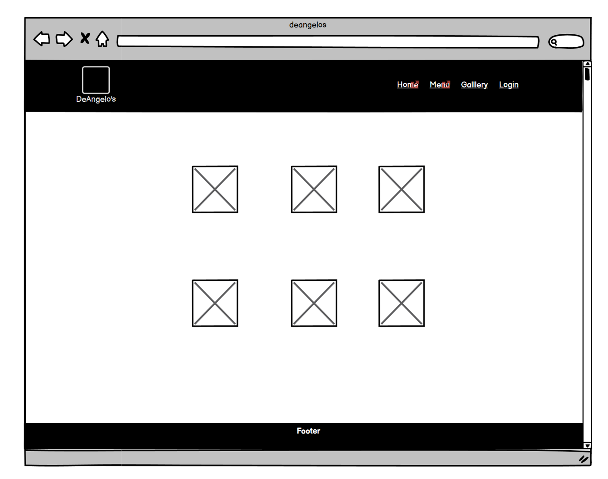
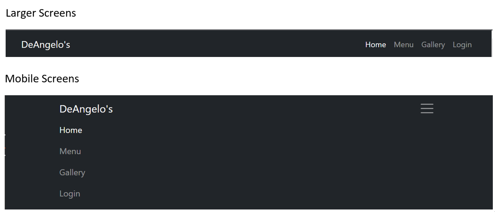
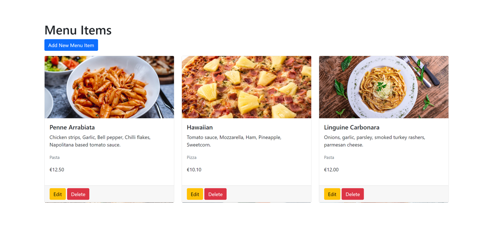

# DeAngelo's Restaurant Booking System

DeAngelo's Restaurant Booking System is a comprehensive digital solution developed to streamline and enhance the dining experience for both customers and administrators of DeAngelo's, a popular local fictitious eatery. The application integrates a range of user-friendly functionalities, offering a seamless interface between customers and staff.

The platform has been primarily developed to cater to the needs of restaurant-goers and the restaurant's administrative personnel. It provides an efficient online booking system for customers seeking to reserve tables at their convenience, while also allowing them to view the restaurant's extensive menu. This interactive, easy-to-navigate system greatly simplifies the booking process and ensures customers can plan their visit to DeAngelo's without any hassle.

For the administrative personnel of DeAngelo's, this system provides a robust back-end solution that offers an overview of the bookings, enables menu management, and handles table arrangements. This ensures smooth operations and improved organization within the restaurant, leading to better service quality and enhanced customer satisfaction.

The DeAngelo's Restaurant Booking System aims to bridge the gap between conventional restaurant management and the growing need for digital interaction in the hospitality industry. With its simple, intuitive design, and effective functionality, it offers a unique, improved dining experience for customers while ensuring efficient, organized operations for the restaurant's staff and administration.

## Design and UX

The application is designed to provide an intuitive and enjoyable user experience for both customers looking to book tables and browse the menu, and for restaurant staff managing bookings and menu items.

### User Interface

The UI is clean and minimalistic to allow for easy navigation and understanding. It has been designed with mobile-first approach, ensuring a smooth user experience on both desktop and mobile devices. The color scheme and typography were carefully chosen to give a sense of elegance and comfort, aligning with the high standards of our restaurant.

### Accessibility

We have ensured that the application is accessible to all users. It includes features such as keyboard navigation and screen reader compatibility. The color contrast has been checked to ensure it is legible for users with color vision deficiencies.

### Responsiveness

The application is fully responsive and is designed to provide an optimal viewing experience across a wide range of devices. Whether the user is accessing the application from a mobile device, tablet, or desktop, the interface adjusts to the screen size, ensuring a seamless user experience.

### Wireframe

Here is the initial wireframe for DeAngelo's

- Home Page

- Menu Page

- Gallery Page

- Profile Page

### Database Model

- Table: Represents a table in the restaurant with attributes table_number and seats.
- Booking: Represents a booking made by a user. It has a foreign key relationship with User and a many-to-many relationship with Table through the TableBooking model.
- TableBooking: An intermediate model for the many-to-many relationship between Booking and Table. It has foreign key relationships with both Booking and Table.
- MenuItem: Represents a menu item in the restaurant with various attributes including name, description, price, category, and image.
- Profile: Represents a user profile with a one-to-one relationship with User.

## User Stories

For user stories I created a GitHub project called Booking-System-PP4. I followed closely the examples from the agile module of the course.

### Users

- As a user I can create an account so that I can make a booking [#1](https://github.com/PajoHack/Booking-System-PP4/issues/1)
- As a user I can view the menu so that so that I can decide what I want to eat [#2](https://github.com/PajoHack/Booking-System-PP4/issues/2)
- As a user I can make a booking so that I can reserve a table at the restaurant [#3](https://github.com/PajoHack/Booking-System-PP4/issues/3)
- As a user I can select the number of guests for my booking so that the restaurant can prepare the necessary seating [#4](https://github.com/PajoHack/Booking-System-PP4/issues/4)
- As a user I can cancel my booking so that I can free up the table for others if I cannot make it [#5](https://github.com/PajoHack/Booking-System-PP4/issues/5)
- As a user I can edit my booking so that I can change the date, time, or number of guests if needed [#7](https://github.com/PajoHack/Booking-System-PP4/issues/7)

### Admins

- As an admin I can create an admin account so that I can manage my restaurant's bookings [#6](https://github.com/PajoHack/Booking-System-PP4/issues/6)
- As an admin I can add, edit, and remove menu items so that I can keep the menu up-to-date [#8](https://github.com/PajoHack/Booking-System-PP4/issues/8)
- As an admin I can be notified when a booking is made so that I can keep track of new reservations [#10](https://github.com/PajoHack/Booking-System-PP4/issues/10)

## Existing features 

- Navigation Bar for customers 
   - When visitors first land on the home page they will see a top nav bar with links to four pages, Home, Menu, Gallery and login. The DeAngelo's branding is also displayed on the left hand side. Clicking the logo returns the user back to the home page.
   - On larger screens a more traditional navigation is displayed, on smaller screens the navigation reverts to a hamburger menu.

  - Registered users will have extra links to their profile page and to the reservations page. The login link changes to logout.

  
  - Signed in Admins will have an extra link to the Admin App

### Site Home Page

The site home page contains a hero image of the Italian countryside. It gives the visitor a sense of the rich, serene, and rustic ambiance associated with traditional Italian dining, setting the stage for a culinary journey through the delights of Italian cuisine.

There is also a section containing a brief synopsis of the restaurant's history.

Scrolling to the lower segment of the home page, the viewer is greeted with a warmly inviting image of the restaurant's interior. The restaurant address and phone number are also displayed.

### Site Footer

the site footer is displayed on all front facing pages. It contains the copyright symbol. Here, visitors can explore a wider array of content concerning the restaurant, with every link thoughtfully designed to open in a separate tab, ensuring undisturbed navigation."

### Menu Page

The menu page contains vibrant imagery of our delectable dishes. Accompanied by both detailed descriptions and transparent pricing, it offers an enticing preview of the culinary delights that await our guests.

### Gallery Page

The gallery page showcases an array of captivating images which we feel captures the essence of our restaurant. To elevate user experience, a simple click on an image triggers a seamless on-page enlargement, offering an up-close view of the image. Additionally, users can effortlessly navigate through these magnified images - right and left - without the need to close each picture first, thereby ensuring a smooth, uninterrupted exploration."

### Reservation Page

The reservation page, accessible only to registered users, elegantly presents a booking form with an accompanying guide on how to fill it out. As the user inputs their details, a script diligently checks the availability of the requested tables. The form incorporates an intelligent validation system, eliminating the possibility of selecting past dates and ensuring that the number of guests does not surpass the capacity of the chosen tables. Furthermore, each table becomes available for new reservations two hours after the start of the previous booking. Only when all these checks are satisfied does the form's submission button become enabled, ensuring a smooth and error-free reservation experience.

This message is displayed when the table is available and all necessary information is provided.

This message is displayed when the table is not available.

These errors are displayed if a date in the past is selected or when a time slot selected is too close to closing time.

Upon making a successful reservation, an automated confirmation email is dispatched to the email address specified in the booking form. Simultaneously, a duplicate of this email is forwarded to the administration group to ensure seamless communication and efficient management.

### Profile Page

The profile page neatly catalogues all the bookings made by a user, affording them the convenience of managing their reservations. Users have the capability to edit or delete their upcoming bookings, ensuring flexibility. However, any bookings from the past remain uneditable and undeletable.

### Login Link

Regular users, upon successful login, are directed to their profile page where they can manage their reservations. Administrators, on the other hand, are guided straight to the admin application, allowing for seamless management of the platform. Non registerd users can click the register link which opens the registration form. 

### Registration

The registration form facilitates the creation of user accounts. To ensure a smooth and transparent registration process, the form clearly outlines the guidelines and requirements for successful account creation.

### Admin App

The Admin App serves as the central hub for site administrators to manage and optimize the DeAngelo's site. The home page of the admin panel displays basic site information.

### Admin Navigation

On devices with larger screen resolutions, the site navigation retains a traditional look and feel. However, for mobile screens, the navigation transitions to a responsive hamburger menu, optimizing user interaction on smaller devices.

The admin navigation contains site management links for, DeAngelo's website, menu items, tables, bookings and the logout feature.

### Admin Menu Items

The 'Menu Items' page displays all current dishes at DeAngelo's. Admins can easily edit or delete items via dedicated buttons. There's also a convenient button for adding new items.

Selecting the 'Add New Menu Item' button displays a form for inputting details of a new menu item.

Selecting the 'Edit' button of a menu item displays a form for editing the details of a menu item.

Clicking the 'Delete' button for a menu item prompts a confirmation screen. If 'Confirm Delete' is chosen, the menu item is permanently removed, opting for 'Cancel' brings the admin back to the menu item overview.

### Admin Tables

The tables pages allows management of the tables in DeAngelo's. Admins can add, modify, or remove tables as required.

Adding, editing and deleting tables.

### Admin Bookings Page

The admin bookings page lists all bookings for the restaurant.It enables the addition of new bookings for instances when customers prefer a phone call over online booking. Administrators can also modify or cancel reservations directly from this page for comprehensive booking management.

This page also has pagination, 10 bookings per page.

The add, edit and delete bookings forms are almost identical to the table management forms.

## Features Left to Implement

- Expand the admin home page.
- Add detail views for the admin menu items.

## Testing

- lighthouse
- HTML. I ran the source code for all pages that render HTML in both the front facing website and the admin app. After fixing some typos and removing extra closing tags I received "Document checking completed. No errors or warnings to show." for all pages.

### Error Handlers

The application is equipped with custom error handlers for handling HTTP 403 (Forbidden), 404 (Not Found), 405 (Method Not Allowed), and 500 (Internal Server Error) status codes. These handlers serve a custom error page to the user whenever one of these HTTP errors occurs.

Each handler is a function in a views file that accepts a request object (and exception object, in the case of 403 and 404 errors) and uses Django's render function to generate an HttpResponse with the appropriate error page and HTTP status code.

Here's a brief overview of each handler:

- handler403: This function handles HTTP 403 errors. It renders a 403.html template and returns an HttpResponse with a status code of 403.
- handler404: This function handles HTTP 404 errors. It renders a 404.html template and returns an HttpResponse with a status code of 404.
- handler405: This function handles HTTP 405 errors. It renders a 405.html template and returns an HttpResponse with a status code of 405.
- handler500: This function handles HTTP 500 errors. It renders a 500.html template and returns an HttpResponse with a status code of 500.

### Testing the Error Handlers

To facilitate testing of these error handlers, I included some views that intentionally raise the corresponding HTTP errors. These views are error_403_view and error_500_view.

Here's how they work:

- error_403_view: When accessed, this view raises a PermissionDenied exception, which triggers a HTTP 403 error and causes our handler403 function to be invoked.
- error_500_view: When accessed, this view raises a generic Exception, which triggers a HTTP 500 error and causes our handler500 function to be invoked.

*These are the function that were used to test error handling.*

*Custom 404 page*

*Custom 403 page*

*Custom 500 page*

### User Stories Testing

The user stories for this project were tested to ensure that all functionalities are working as expected. Each user story was treated as a separate feature and tested individually. The testing process was carried out in the following manner:

- Account Creation: The ability for users and admins to create accounts was tested. New accounts were created with various data sets to ensure that the account creation process is robust and error-free. The successful creation of new accounts confirmed the successful implementation of this feature.
- Menu Viewing: The functionality for users to view the menu was tested. Different users were used to access the menu page and the correct display of menu items was confirmed.
- Booking Creation, Editing, and Cancellation: The booking system was tested extensively. Bookings were created, edited, and cancelled multiple times to ensure the system can handle these operations smoothly. The ability to select the number of guests during booking was also tested and confirmed.
- Admin Functions: The admin functionalities were tested by creating an admin account and using it to add, edit, and remove menu items. The changes were confirmed on the user side to ensure they were correctly implemented. The notification system for new bookings was also tested and confirmed to be working as expected.

All tests were successful, indicating that the user stories were correctly implemented. However, it's important to note that testing is an ongoing process. As new features are added or existing ones are modified, further testing will be conducted to ensure the continued functionality and reliability of the system.

### Validator Testing

- html
- css

### Unfixed Bugs

One of the known issues that we're currently facing involves the interaction between Mailjet and Yahoo Mail. Yahoo Mail has been rejecting emails sent via Mailjet because the sending email address does not originate from a domain address. This is due to Yahoo Mail's stringent DMARC (Domain-based Message Authentication, Reporting & Conformance) policy. 

When Mailjet attempts to send an email using a Yahoo email address, Yahoo's servers recognize that the email did not originate from their own servers and reject it. This is a security measure to protect Yahoo Mail users from potentially harmful emails. 

If testing out the email notifications please either use a domain address, or gmail also works but the email may be sent to your spam folder.

## Deployment

This section walks you through the process of deploying this project to a production environment. The project uses Django for backend development, various supporting libraries for enhanced functionalities, and was ultimately deployed via Heroku.

### Django & supporting libraries

- A Django project named 'deangelos' was initiated in a Gitpod workspace created from the CI gitpod-full-template on GitHub.

- Gunicorn, a Python WSGI HTTP server, was installed to manage the application server using `pip3 install 'django<4' gunicorn`.

- Key libraries, such as dj_database_url and psycopg2, were installed for PostgreSQL interactions via the command `pip3 install dj_database_url==0.5.0 psycopg2`.

- Cloudinary, an end-to-end image- and video-management solution, was used to handle the project's media storage. It was installed using `pip3 install dj3-cloudinary-storage and pip3 install urllib3==1.26.15`.

- The dependencies used in the project were captured in a requirements.txt file using `pip3 freeze --local > requirements.txt`.

- A Django app named 'bookings' was created using `python3 manage.py startapp bookings` and added to the 'INSTALLED_APPS' list in the project settings.

- Django widget tweaks were installed for form field customization using `pip install django-widget-tweaks`. This addition required a updated requirements.txt file.

- Django migrations were applied to incorporate the new app and changes to the database schema with `python3 manage.py migrate`.

- The server was run using python3 `manage.py runserver` to ensure it worked in the local environment. Necessary changes were made to the settings to rectify any 'DisallowedHost' errors.

### Heroku Deployment & Database Setup

- An external PostgreSQL database was created on ElephantSQL, and its URL was copied to connect it to the Heroku app.

- In Heroku, a new app was created and a config variable named `DATABASE_URL` was set with the ElephantSQL database URL.

- A secret key was generated and added as a config var in Heroku.

- The ElephantSQL database URL was included in the Django settings file through the env.py file.

- The Cloudinary API Environment Variable was included in the Django settings file and as a config var in Heroku for media and static file management.

- Heroku was instructed not to collect static files during the initial deployment by setting the `DISABLE_COLLECTSTATIC` config var to 1.

- Django was configured to use Cloudinary for media and static files, and the templates directory was linked in settings.py.

- The Heroku app domain was added to the ALLOWED_HOSTS list in settings.py.

- A Procfile was created to specify the commands that are executed by the Heroku app on startup. Gunicorn was set as the WSGI HTTP server.

- After committing and pushing all changes to GitHub, the Heroku app was manually deployed from the main branch. Thereafter, automatic deployments were set up to occur whenever the main branch on GitHub is updated.

The entire process led to a smooth deployment on Heroku with an interactive and user-friendly restaurant booking application ready for public access.

### Cloning 

- Find the Repository: Navigate to the main page of the repository on GitHub.
- Copy the Repository URL: Click on the green "Code" button on the right side of the repository page. This will open a dropdown menu. Make sure "HTTPS" is selected and then click the clipboard icon to copy the repository URL.
- Open Terminal or Command Prompt: On your local machine, open your terminal (Mac/Linux) or command prompt (Windows).
- Navigate to Desired Directory: Use the cd command to navigate to the directory where you want to clone the repository.
- Clone the Repository: Type git clone, paste the URL you copied earlier, and press Enter. The command should look like this: git clone https://github.com/username/repository.git
- Access the Repository: Once the repository has been cloned, navigate into the new directory (which will have the same name as the repository) by using the cd command again: cd repository-name
- Check the Repository: You can use the ls command (or dir on Windows) to list the files in the directory and confirm that you've successfully cloned the repository.

### Forking

- Find the Repository: Navigate to the main page of the repository on GitHub that you want to fork.
- ork the Repository: Click on the "Fork" button at the top right corner of the repository page. This will create a copy of the repository under your GitHub account.
- Navigate to Your Forked Repository: Once the forking process is complete, you'll be redirected to the main page of your new forked repository. You can also access it later by going to your GitHub profile and clicking on the repository name under "Your repositories".
- Clone the Forked Repository: If you want to work on the project locally, you can clone the forked repository to your machine. Click on the green "Code" button on the right side of the repository page, copy the URL, and then use the git clone command in your terminal or command prompt: git clone https://github.com/your-username/repository.git
- Access the Repository: Once the repository has been cloned, navigate into the new directory (which will have the same name as the repository) by using the cd command: cd repository-name
- Check the Repository: You can use the ls command (or dir on Windows) to list the files in the directory and confirm that you've successfully cloned the repository.

## Credits

- The home page template and css was taken from [Start Bootstrap](https://startbootstrap.com/template/full-width-pics)

## Media

### Home Page Images

- The image of the Italian Countryside on the top part of the screen was taken from [Unsplash](https://unsplash.com/photos/haO04L8LoaU).
- The image of the restaurant in the bottom part of the screen was taken from [Unsplash](https://unsplash.com/photos/wfM1Fi-kMaY).

### Menu Images

- Garlic Bread [Freepik](https://www.freepik.com/free-photo/baked-cheese-camembert-with-rosemary-honey-tasty-food_6733581.htm).
- Focaccia Mozzarella [IEatKeto](https://www.ieatketo.com/does-mozzarella-cheese-have-carbs/).
- Minestrone Soup [Unsplash](https://unsplash.com/s/photos/minestrone-soup).
- Mussels [Unsplash](https://unsplash.com/photos/DnBhidfyiH8).
- Hazaiian Pizza [Unsplash](https://www.freepik.com/free-photo/hawaiian-pizza-with-pineappleham-cheese-isolated-white-background_24188452.htm#query=pineapple%20pizza&position=0&from_view=keyword&track=ais).
- Vegetarian Pizza [Unsplash](https://unsplash.com/photos/jsZKLRi7toU).
- Margherita Pizza [Good Food Ireland](https://goodfoodireland.ie/blog/pizza-in-ireland/).
- Inferno Pizza [Feepik](https://www.freepik.com/free-photo/top-view-cheesy-tomato-pizza-with-olives-sausages-inside-pan-brown-desk-pizza-food-meal-fast-food-cheese-sausage_10543386.htm)
- Lasagne [Feepik](https://www.freepik.com/free-photo/baked-lasagna-with-gourmet-italian-bolognese-sauce-generated-by-ai_40968080.htm#query=italy%20food&position=19&from_view=keyword&track=ais)
- Penne Arrabiata [Freepik](https://www.freepik.com/free-photo/side-view-penne-pasta-with-tomato-sauce-salt-pepper-herbs-plate_8196771.htm).
- Carbonara [Freepik](https://www.freepik.com/free-photo/top-view-cheesy-pasta-white-plate_10720733.htm#query=pasta%20carbonara&position=3&from_view=keyword&track=ais).
- Ravioli [Unsplash](https://unsplash.com/photos/h7xulIktCg8).

### Gallery Images

- Chef [Unsplash](https://unsplash.com/photos/bjiD-5tAguc).
- Interior of restaurant [Unsplash](https://unsplash.com/photos/wfM1Fi-kMaY).
- Italian Country [Unsplash](https://unsplash.com/photos/haO04L8LoaU).
- A table at DeAngelo's [freepik](https://www.freepik.com/free-photo/fettuccine-with-tomato-sauce-minced-meat-garnished-with-grated-parmesan_7570874.htm#query=italian%20restaurant&position=1&from_view=keyword&track=ais).
- DeAngelo's Pizza [Freepik](https://www.freepik.com/free-photo/side-view-pizza-wooden-stand-with-tablecloth-hand-take-slice-pizza_7703842.htm)
- Selection of ingrediants used in house [Medium](https://vsfranklin.medium.com/use-your-refrigerator-like-an-endless-mise-en-place-d81216eeed50)

## Development 

In the development process of this project, I have utilized two additional GitHub repositories for practice and experimentation. The first repository, named 'restaurant-booking-PP4', served as a playground for testing various features and functionalities related to restaurant booking systems. This allowed me to refine my skills and gain a deeper understanding of the complexities involved in such systems. The second repository, 'admin-template', was used to experiment with different admin panel layouts and functionalities. It provided me with the opportunity to explore various design patterns and user interface elements commonly used in admin panels. Both of these repositories have played a crucial role in shaping the development of the main project.